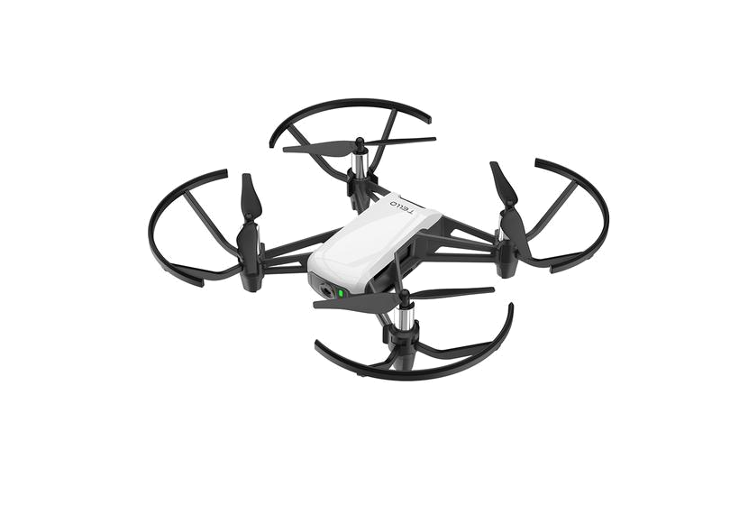

# Tello Data Collector

Este trabalho está sendo realizado com o objetivo de obter dados do drone DJI Tello para que possa ser feita uma análise e seus dados tratados para aplicação em diversos algoritmos. Além disso, pode-se entender o comportamento de um drone diante de diversos cenários e realizar ações para evitar cenários ruins.

Segundo o [SDK (Software Development Kit)](https://terra-1-g.djicdn.com/2d4dce68897a46b19fc717f3576b7c6a/Tello%20%E7%BC%96%E7%A8%8B%E7%9B%B8%E5%85%B3/For%20Tello/Tello%20SDK%20Documentation%20EN_1.3_1122.pdf) do Tello, é possível acessar uma de suas portas para coletar seu *status*. Segundo o documento, seu status fornece as seguintes informações:

> “pitch:%d;roll:%d;yaw:%d;vgx:%d;vgy%d;vgz:%d;templ:%d;temph:%d;tof:%d;h:%d;bat:%d;baro:%.2f; time:%d;agx:%.2f;agy:%.2f;agz:%.2f;\r\n”

Calma, essa é a forma que a lista é retornada, o que indica que o que for *%d* é uma variável inteira e *%.2f* uma variável do tipo flutuante. Baseado nessas informações, podemos separá-las em uma lista e organizar em uma tabela. Mas antes, segue a lista de itens e seus significados:

* pitch: attitude pitch, em graus
* roll: attitude roll, em graus
* yaw: attitude yaw, em graus
* vgx: velocidade em x, 
* vgy: velocidade em y,
* vgz: velocidade em z,
* templ: limite inferior da temperatura, em graus celsius
* temph: limite superior da temperatura, em graus celsius
* tof: distância TOF, em cm
* h: altura, em cm
* bat: porcentagem atual da bateria,  em %
* baro: medida do barômetro, em cm
* time: tempo do motor,
* agx: aceleração do drone em x,
* agy: aceleração do drone em y,
* agz: aceleração do drone em z,

### [RESULTADOS PRELIMINARES PODEM SER VISTOS AQUI](Analisando alguns dados.ipynb)